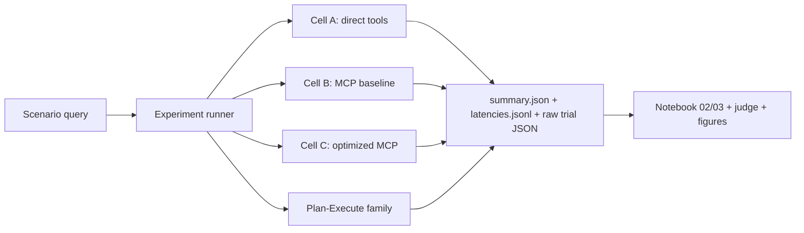

# Final Presentation Deck Draft

*Created: 2026-05-02*
*Owner: Alex Xin*
*Issue: #44*
*Mode: slide-content scaffold plus first editable PowerPoint draft*

This is the first reviewable slide-by-slide deck draft for the HPML final
presentation. The Markdown remains the source-of-truth story scaffold so
teammates and reviewers can comment on claims and wording, while the current
editable PPTX build lives at
`reports/2026-05-03_final_presentation_smartgridbench_draft.pptx`.

Production companion: `docs/final_presentation_run_of_show.md`.

## May 3 PPTX Build

The first editable PowerPoint draft has been generated from the current story
spine. It is intentionally a draft, not the final submitted deck, because #44
still needs the class template migration, current evidence freeze, IBM upstream
PR status callout, and a timed dry run.

| Artifact | Status | Notes |
|---|---|---|
| `reports/2026-05-03_final_presentation_smartgridbench_draft.pptx` | built | 12-slide editable PPTX; dark technical visual system; issue remains open. |
| Final HPML template rebuild | pending | Rebuild from this 13-slide scaffold into the required class template before submission. |
| Layout QA | pass with warnings | Artifact-tool checker: 0 errors / 7 padding or tight-text warnings; visual contact sheet reviewed. |
| Build provenance | documented | `reports/build_notes/2026-05-03_final_presentation_smartgridbench_build.md` records the one-off artifact-tool command, integrity checks, and warning inventory. |
| Scenario slide | current | 36 paper-grade canonical scenarios + 5 negative fixtures define the evaluated corpus (31 hand-authored + 5 promoted generated); repo currently has 61 scenario files because PR #199 added 25 post-submission stretch scenarios that are not in paper claims; result tables remain scoped to the 31-scenario post-PR175 floor unless explicitly refreshed. |
| Mitigation slide | current | PR #198 landed the post-PR175 before/after rows; keep the claim to mixed effects, not universal lift. |

## May 2 Deck Readiness

The deck is ready for a first PowerPoint build pass. The slide spine, current
tables, source paths, and backup Q&A are in place. The remaining work is not
"find the story"; it is final evidence freeze, visual conversion, and dry-run.

| Component | Status | Open caveat |
|---|---|---|
| Core deck spine | ready | final timing pass still needed |
| Scenario status slide | draft-ready | distinguish 36-scenario corpus from 31-scenario result floor |
| Transport result slide | draft-ready | caption as first six-trial capture |
| Orchestration result slide | draft-ready | keep Self-Ask as follow-on, not core baseline |
| Failure taxonomy slide | current | use PR #197 current audit surface, not the historical 35-row table |
| Mitigation ladder slide | current | PR #198 post-PR175 before/after rows measured; mixed-effect framing |
| Upstreaming callout | needs PPTX update | [IBM AssetOpsBench PR #287](https://github.com/IBM/AssetOpsBench/pull/287) is draft-open now and should be marked Ready once the draft/DCO gate clears. |
| Backup Q&A | draft-ready | keep Cell D / 70B as closed exploratory context unless promoted in the main paper text |

Recommended target: 10-12 minutes plus Q&A. If time compresses, keep Slides
1-10 and 12-13; shorten Slide 11 (mitigation) rather than cutting Slide 10
(failure taxonomy).

## Deck Spine

Core thesis:

> SmartGridBench is not only a Smart Grid extension of AssetOpsBench. It is a
> systems study showing that protocol choice, orchestration choice, and evidence
> accounting all change what an industrial-agent benchmark can honestly claim.

Audience job:

- understand the benchmark artifact
- understand the two experiment axes
- see the strongest current quantitative evidence
- see why failure taxonomy and mitigation matter
- leave with a clear sense of what is complete and what remains caveated

Run-of-show rule:

- slides 1-3 establish the artifact
- slides 4-6 establish why the experiment matrix is controlled rather than a
  full grid
- slides 7-10 deliver transport, profiling, orchestration, and failure evidence
- slides 11-13 convert evidence into mitigation, reproducibility, and conclusion

## Visual System Notes

Use a technical, evidence-first deck style:

- dark slate background or white class-template background with high-contrast
  teal/orange accents
- one claim per slide
- diagrams before bullets when possible
- every results slide needs a source line with run IDs or CSV paths
- no decorative "AI agent" clip art
- use canonical display codes from `results/metrics/experiment_matrix_summary.csv`

## Slide List

### Slide 1 - Title

**SmartGridBench: MCP-Based Industrial Agent Benchmarking for Smart Grid
Transformer Operations**

Subtitle:

Team 13 / District 1101 - HPML Spring 2026

Presenter notes:

- One-sentence opener: "We extended AssetOpsBench into Smart Grid transformer
  maintenance and used it to measure how tool protocol and orchestration choices
  affect agent latency, quality, and evidence reliability."
- Transition: "The important part is that we did not treat the benchmark
  plumbing as invisible; we made it measurable."

### Slide 2 - Problem: Industrial Agents Need Evidence, Not Just Answers

Claim:

Smart Grid transformer maintenance is a high-stakes multi-tool workflow, and
current industrial-agent benchmarks under-cover this domain.

Proof points:

- Transformer maintenance requires telemetry, DGA diagnosis, forecasting, and
  work-order decisions.
- A believable agent must retrieve evidence before finalizing maintenance
  recommendations.
- This is a natural benchmark setting for testing tool-using LLM agents.

Visual:

Four-step maintenance workflow: telemetry -> diagnosis -> forecast -> work
order.

Speaker note:

"This is why the domain works for HPML: it is small enough to benchmark, but it
still forces multi-tool evidence gathering."

### Slide 3 - What We Built

Claim:

SmartGridBench extends AssetOpsBench with a Smart Grid transformer domain,
MCP-backed tools, and an upstream-ready AssetOpsBench integration path.

Table:

| Domain | Role |
|---|---|
| IoT | Sensor and operating context retrieval |
| FMSR | DGA/failure-mode reasoning |
| TSFM | Forecasting and anomaly detection |
| WO | Maintenance work-order creation |

Source:

`mcp_servers/`, `data/scenarios/README.md`, `docs/data_pipeline.tex`,
`data/scenarios/*.json`, `data/scenarios/negative_checks/*.json`, PR #195,
[IBM AssetOpsBench PR #287](https://github.com/IBM/AssetOpsBench/pull/287).

Speaker note:

"The shared transformer key is what turns these into one benchmark trajectory
instead of four unrelated toy tools."

### Slide 4 - Workload / Dataset Overview

Claim:

SmartGridBench is a controlled transformer-maintenance workload, not a
scenario-count status report.

Key facts:

- Paper-grade canonical: 36 positive scenarios + 5 negative validation fixtures
  (frozen at NeurIPS submission, 2026-05-07).
- Scenario provenance: 31 hand-authored scenarios plus 5 generated-source
  scenarios accepted with edits and promoted in PR #195.
- Repo current: 61 scenario files in `data/scenarios/`. The 25 beyond paper-grade
  came post-submission via PR #199 (#55 batch A and B) and are deliberately
  excluded from paper/CourseWorks claims.
- Current result tables and failure evidence are still mostly post-PR175 /
  31-scenario evidence; do not silently imply a full 36-scenario evaluation,
  and never imply evaluation across the 61 repo total.
- [IBM AssetOpsBench PR #287](https://github.com/IBM/AssetOpsBench/pull/287)
  is open as a draft upstream cut for the 36-scenario Smart Grid
  domain/data/test package.

Visual:

Use the text-collision-fixed dataset overview from the release-owner asset
bundle (committed locally to `results/figures/notebook01_dataset_overview.png`
when included in the public package).
Do not use a scenario-count progress/status bar.

Speaker note:

"This slide should orient the audience to the workload. The count caveat belongs
in the caption or source footer: 36 paper-grade canonical scenarios define the
evaluated corpus (31 hand-authored + 5 promoted generated); 25 additional
scenarios from PR #199 sit in the repo but are not in paper claims; result
tables use the 31-scenario post-PR175 evidence floor."

### Slide 5 - Architecture: One Artifact Contract Across Cells

Claim:

The key systems decision was to force all experiment lanes into one benchmark
artifact contract.

Diagram:

Source:

`scripts/run_experiment.sh`, `benchmarks/cell_<X>/`, `docs/validation_log.md`

### Slide 6 - Experiment Design

Claim:

We separate transport effects from orchestration effects instead of running an
uncontrolled full grid.

Table:

| Experiment | Cells | Measures |
|---|---|---|
| Transport | A direct, B MCP baseline, C optimized MCP | latency, tool-call overhead, profiling |
| Orchestration | B Agent-as-Tool, Y Plan-Execute, Z Verified PE | success, judge quality, failure shape |
| Follow-on | YS, ZS, ZSD | mitigation and optimized-serving evidence |

Speaker note:

"B is the anchor cell: it is both the MCP transport baseline and the
Agent-as-Tool orchestration baseline."

Avoid:

- implying that every orchestration strategy was crossed with every transport
  condition
- treating Cell D as the main optimized MCP result; it changes model-serving
  variables too

### Slide 7 - Result 1: MCP Transport Has a Cost, but Optimization Changes the Shape

Claim:

Optimized persistent MCP reduced p50 latency in the first six-trial capture, but
quality did not improve automatically.

Table:

| Cell | Meaning | p50 latency | p95 latency | Judge pass |
|---|---|---:|---:|---:|
| A / AT-I | Direct tools | 12.15s | 17.29s | 1/6 |
| B / AT-M | MCP baseline | 13.09s | 16.27s | 2/6 |
| C / AT-TP | Optimized MCP | 7.40s | 47.93s | 0/6 |

Narrative:

- B vs A gives the first direct MCP overhead comparison.
- C improves steady-state latency but has a cold-start tail.
- Transport optimization is not the same as answer-quality optimization.

Source:

`results/metrics/notebook02_latency_summary.csv`,
`results/metrics/experiment_matrix_summary.csv`

Speaker note:

"This result is a systems story, not a leaderboard. The p50 improvement is real
in the first capture, but the p95 tail and judge score tell us not to oversell
transport optimization as quality improvement."

### Slide 8 - Profiling Evidence and Observability

Claim:

The current repo now has a profiling inventory that measures observability
coverage, and the newest spot checks expose a real instrumentation gap rather
than a run failure.

Inventory:

| Evidence surface | Count |
|---|---:|
| Run rows in profiling inventory | 104 |
| W&B-linked rows | 63 |
| Profiler-linked rows | 13 |
| Rows with profiling summary stats | 6 |

Spot-check evidence:

| Row | Scope | W&B | `nvidia-smi` summary | Torch trace |
|---|---|---|---|---|
| `AT_M` | 1 scenario / 1 trial | yes | yes | yes |
| `AT_T` | 1 scenario / 1 trial | yes | yes | yes |
| `PE_S_M` | 1 scenario / 1 trial | yes | yes | no |
| `V_S_M` | 1 scenario / 1 trial | yes | yes | no |

Interpretation:

- The new spot checks are profiling / observability evidence only.
- They should not be used as judged task-quality evidence: no judge rows and no
  evidence-registry promotion were performed.
- `PE_S_M` and `V_S_M` completed W&B + `nvidia-smi` profiling, but did not emit
  torch traces. Frame this as a profiling-hook coverage gap for PE / Verified
  PE rows, not as a failed run.

Source:

`results/metrics/profiling_inventory.csv`

Speaker note:

"For the class framing, this is one of the most HPML-native artifacts: we are
not just reporting task scores; we are showing which runs are observable, which
are dashboard-linked, and where our profiler hooks still have coverage gaps.
The performance interpretation should be human-reviewed against the raw traces
and dashboard rows."

### Slide 9 - Result 2: Orchestration Quality Is Not Monotonic

Claim:

Plan-Execute alone underperforms, but verification and Self-Ask materially
change judged quality.

Table:

| Cell | Meaning | Success | Judge mean | Judge pass |
|---|---|---:|---:|---:|
| B / AT-M | Agent-as-Tool MCP | 1.0 | 0.278 | 2/6 |
| Y / PE-M | Plan-Execute | 0.5 | 0.111 | 0/6 |
| Z / V-M | Verified PE | 1.0 | 0.639 | 4/6 |
| YS / PE-S-M | PE + Self-Ask | 1.0 | 0.444 | 3/6 |
| ZS / V-S-M | Verified PE + Self-Ask | 1.0 | 0.833 | 5/6 |

Speaker note:

"This is the story Dhaval hinted at: Agent-as-Tool is a strong benchmark
default, while structured orchestration becomes interesting when it has enough
verification machinery to avoid unsupported final answers."

Source:

`results/metrics/notebook03_orchestration_comparison.csv`,
`results/metrics/notebook03_self_ask_ablation.csv`,
`results/metrics/experiment_matrix_summary.csv`

Speaker note addendum:

"The result I would emphasize is not 'PE wins.' Vanilla PE is weak. The result
is that structured orchestration needs clarification and verification to become
competitive."

### Slide 10 - Failure Taxonomy: Most Failures Are Evidence Failures

Claim:

Across the current paper-grade failure inventory, the dominant symptoms are
missing or weak task completion and evidence grounding, not transport plumbing.

Table:

| Auto-label symptom | Rows | Percent of paper-grade failures |
|---|---:|---:|
| Task completion | 944 | 74.0% |
| Data retrieval accuracy | 182 | 14.3% |
| Agent sequence correctness | 78 | 6.1% |
| Result verification | 72 | 5.6% |

Manual audit overlay:

| Surface | Current result |
|---|---|
| Paper-grade failures | 1,276 across 2,420 paper-grade judge rows |
| PR #197 stratified audit | 46 rows, one per non-empty `(cell, auto-label)` stratum |
| Audit decisions | 42 confirmed, 3 evidence-thin, 1 relabel suggested |
| Recurring patterns | 6 patterns spanning 23 audit rows and 6 distinct scenarios |

Visual:

Use `results/figures/failure_taxonomy_current_auto_label_counts.svg`; keep the
manual-audit pattern table as text or backup detail.

Source:

`results/metrics/failure_taxonomy_current.csv`,
`results/metrics/failure_taxonomy_current_auto_label_counts.csv`,
`results/metrics/failure_taxonomy_current_manual_audit_counts.csv`,
`docs/failure_taxonomy_audit_2026-05-07.md`, PR #197.

Speaker note:

"The important thing here is that a run can complete and still be semantically
unsafe. The 46-row manual audit is coverage-oriented, not prevalence-weighted,
so use it for examples and recurring patterns rather than population rates."

Transition:

"Once we know the dominant failure mode, the mitigation space gets smaller and
more disciplined."

### Slide 11 - Mitigation Ladder

Claim:

We turn failure analysis into a bounded mitigation ladder instead of a
combinatorial experiment grid.

Mitigation ladder:

| Rung | Mitigation | Status |
|---:|---|---|
| 0 | Baseline PE-family runs | Captured |
| 1 | Missing-evidence final-answer guard | Measured post-PR175 |
| 2 | Missing-evidence retry/replan guard | Measured post-PR175 |
| 3 | Explicit fault/risk adjudication step | Measured post-PR175 |

Result snapshot:

| Family | Baseline judge pass | Guard | Repair/replan | Adjudication | Read |
|---|---:|---:|---:|---:|---|
| YS | 40/75 | 36/75 | 36/75 | 31/75 | accounting/repair changes behavior, but not a quality lift |
| ZS | 36/75 | 35/75 | 37/75 | 31/75 | repair gives the only small positive lift: +1 pass, +0.0089 mean score |

Source:

`docs/failure_visuals_mitigation.md`,
`results/metrics/mitigation_run_inventory.csv`,
`results/metrics/mitigation_before_after.csv`

Speaker note:

"PR #198 makes this a current before/after result slide. Keep the claim narrow:
the ladder improves accounting/refusal semantics and gives a bounded repair
path, but measured judge-score effects are mixed rather than a universal lift."

### Slide 12 - Reproducibility and Deliverables

Claim:

The repo is designed so claims can be traced back to artifacts, not just slide
numbers.

Proof objects:

- benchmark raw artifacts under `benchmarks/cell_<X>/raw/<run-id>/`
- run ledger in `docs/validation_log.md`
- metrics under `results/metrics/`
- figures under `results/figures/`
- Overleaf NeurIPS project with official 2026 template
- [IBM AssetOpsBench PR #287](https://github.com/IBM/AssetOpsBench/pull/287)
  opened as a draft upstream cut for the Smart Grid domain/data/tests; mark it
  Ready in the slide once the draft/DCO gate clears.

Visual:

Artifact map from run ID -> metrics CSV -> figure -> paper/deck claim.

Speaker note:

"This is the reproducibility promise: every claim on the results slides should
point to a metric file, figure, run ID, or upstream PR."

### Slide 13 - Conclusion

Claim:

SmartGridBench shows that benchmark design choices shape industrial-agent
conclusions.

Takeaways:

1. Smart Grid transformer maintenance is a realistic multi-tool benchmark
   domain.
2. MCP standardization is measurable: it affects latency and architecture, but
   not automatically quality.
3. Orchestration quality depends on evidence grounding and verification, not
   just plan structure.
4. Failure taxonomy and mitigation should be first-class benchmark artifacts.
5. The upstream path is now concrete: IBM AssetOpsBench PR #287 is open, with
   follow-on orchestration/evaluation PRs deferred after the thin domain cut.

Closing sentence:

"The deliverable is not just a working demo; it is an auditable benchmark
extension with a real upstreaming path for asking better questions about
industrial tool-using agents."

## Backup / Q&A Slides

### Backup A - Why not run the full grid?

Answer:

The full orchestration-by-transport grid would be underpowered and deadline
risky. We instead isolate one variable at a time: transport in A/B/C,
orchestration in B/Y/Z, then clearly label follow-on ablations.

### Backup B - Why does optimized MCP not improve quality?

Answer:

Cell C optimizes transport/session behavior. It does not change the model's
reasoning, evidence retrieval policy, or final-answer grounding. Quality needs
judge and failure-analysis evidence, not only latency metrics.

### Backup C - What is the strongest current result?

Answer:

Verified PE + Self-Ask (`ZS`) is the strongest current judged quality row:
mean judge score `0.833` and `5/6` judge-pass. The strongest systems point is
that this row should be reported as a PE-family follow-on, not quietly folded
into the vanilla Plan-Execute baseline.

### Backup D - What remains before final submission?

Answer:

The critical remaining work is class-template deck rebuild, final figure
captions, Overleaf/report compile checklist, README/report back-port, and
updating the IBM PR #287 badge once it moves from draft to Ready before the
talk.
