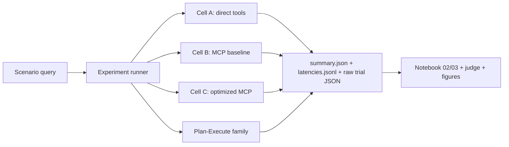

# Final Presentation Deck Draft

*Created: 2026-05-02*
*Owner: Alex Xin*
*Issue: #44*
*Mode: slide-content scaffold for later PowerPoint conversion*

This is the first reviewable slide-by-slide deck draft for the HPML final
presentation. It is intentionally Markdown so teammates and reviewers can
comment on the story before we convert it into the class PowerPoint template.

## Deck Spine

Core thesis:

> SmartGridBench is not only a Smart Grid extension of AssetOpsBench. It is a
> systems study showing that protocol choice, orchestration choice, and evidence
> accounting all change what an industrial-agent benchmark can honestly claim.

Audience job:

- understand the benchmark artifact
- understand the two experiment axes
- see the strongest current quantitative evidence
- see why failure taxonomy and mitigation matter
- leave with a clear sense of what is complete and what remains caveated

## Visual System Notes

Use a technical, evidence-first deck style:

- dark slate background or white class-template background with high-contrast
  teal/orange accents
- one claim per slide
- diagrams before bullets when possible
- every results slide needs a source line with run IDs or CSV paths
- no decorative "AI agent" clip art
- use canonical display codes from `results/metrics/experiment_matrix_summary.csv`

## Slide List

### Slide 1 - Title

**SmartGridBench: MCP-Based Industrial Agent Benchmarking for Smart Grid
Transformer Operations**

Subtitle:

Team 13 / District 1101 - HPML Spring 2026

Presenter notes:

- One-sentence opener: "We extended AssetOpsBench into Smart Grid transformer
  maintenance and used it to measure how tool protocol and orchestration choices
  affect agent latency, quality, and evidence reliability."

### Slide 2 - Problem: Industrial Agents Need Evidence, Not Just Answers

Claim:

Smart Grid transformer maintenance is a high-stakes multi-tool workflow, and
current industrial-agent benchmarks under-cover this domain.

Proof points:

- Transformer maintenance requires telemetry, DGA diagnosis, forecasting, and
  work-order decisions.
- A believable agent must retrieve evidence before finalizing maintenance
  recommendations.
- This is a natural benchmark setting for testing tool-using LLM agents.

Visual:

Four-step maintenance workflow: telemetry -> diagnosis -> forecast -> work
order.

### Slide 3 - What We Built

Claim:

SmartGridBench extends AssetOpsBench with a Smart Grid transformer domain and
four MCP-backed tool domains.

Table:

| Domain | Role |
|---|---|
| IoT | Sensor and operating context retrieval |
| FMSR | DGA/failure-mode reasoning |
| TSFM | Forecasting and anomaly detection |
| WO | Maintenance work-order creation |

Source:

`mcp_servers/`, `data/scenarios/README.md`, `docs/data_pipeline.tex`,
`data/scenarios/*.json`, `data/scenarios/negative_checks/*.json`, PR #156.

### Slide 4 - Scenario Corpus Status

Claim:

The benchmark corpus is deadline-critical: the proposal floor is 30 validated
scenarios, and the final set must distinguish merged facts from pending work.

Current status:

- Canonical `team13/main`: 11 positive scenarios + 5 negative validation fixtures.
- PR #156: adds 10 hand-crafted scenarios, raising the hand-authored positive
  set to 21 after merge.
- Generator-accepted scenarios still need to clear the 30-scenario floor.

Visual:

Progress bar: 11 merged -> 21 after PR #156 -> 30 required.

### Slide 5 - Architecture: One Artifact Contract Across Cells

Claim:

The key systems decision was to force all experiment lanes into one benchmark
artifact contract.

Diagram:

Source:

`scripts/run_experiment.sh`, `benchmarks/cell_<X>/`, `docs/validation_log.md`

### Slide 6 - Experiment Design

Claim:

We separate transport effects from orchestration effects instead of running an
uncontrolled full grid.

Table:

| Experiment | Cells | Measures |
|---|---|---|
| Transport | A direct, B MCP baseline, C optimized MCP | latency, tool-call overhead, profiling |
| Orchestration | B Agent-as-Tool, Y Plan-Execute, Z Verified PE | success, judge quality, failure shape |
| Follow-on | YS, ZS, ZSD | mitigation and optimized-serving evidence |

Speaker note:

"B is the anchor cell: it is both the MCP transport baseline and the
Agent-as-Tool orchestration baseline."

### Slide 7 - Result 1: MCP Transport Has a Cost, but Optimization Changes the Shape

Claim:

Optimized persistent MCP reduced p50 latency in the first six-trial capture, but
quality did not improve automatically.

Table:

| Cell | Meaning | p50 latency | p95 latency | Judge pass |
|---|---|---:|---:|---:|
| A / AT-I | Direct tools | 12.15s | 17.29s | 1/6 |
| B / AT-M | MCP baseline | 13.09s | 16.27s | 2/6 |
| C / AT-TP | Optimized MCP | 7.40s | 47.93s | 0/6 |

Narrative:

- B vs A gives the first direct MCP overhead comparison.
- C improves steady-state latency but has a cold-start tail.
- Transport optimization is not the same as answer-quality optimization.

Source:

`results/metrics/notebook02_latency_summary.csv`,
`results/metrics/experiment_matrix_summary.csv`

### Slide 8 - Result 2: Orchestration Quality Is Not Monotonic

Claim:

Plan-Execute alone underperforms, but verification and Self-Ask materially
change judged quality.

Table:

| Cell | Meaning | Success | Judge mean | Judge pass |
|---|---|---:|---:|---:|
| B / AT-M | Agent-as-Tool MCP | 1.0 | 0.278 | 2/6 |
| Y / PE-M | Plan-Execute | 0.5 | 0.111 | 0/6 |
| Z / V-M | Verified PE | 1.0 | 0.639 | 4/6 |
| YS / PE-S-M | PE + Self-Ask | 1.0 | 0.444 | 3/6 |
| ZS / V-S-M | Verified PE + Self-Ask | 1.0 | 0.833 | 5/6 |

Speaker note:

"This is the story Dhaval hinted at: Agent-as-Tool is a strong benchmark
default, while structured orchestration becomes interesting when it has enough
verification machinery to avoid unsupported final answers."

Source:

`results/metrics/notebook03_orchestration_comparison.csv`,
`results/metrics/notebook03_self_ask_ablation.csv`

### Slide 9 - Failure Taxonomy: Most Failures Are Evidence Failures

Claim:

The largest current failure class is task verification, not transport plumbing.

Table:

| Failure class | Rows | Percent |
|---|---:|---:|
| Task verification failure | 18 | 51.4% |
| Inter-agent / orchestration failure | 13 | 37.1% |
| Specification failure | 4 | 11.4% |

Visual:

Use `results/figures/failure_taxonomy_counts.svg` and
`results/figures/failure_stage_cell_heatmap.svg`.

Source:

`results/metrics/failure_taxonomy_counts.csv`,
`results/metrics/failure_stage_cell_counts.csv`,
`results/figures/failure_taxonomy_counts.svg`,
`results/figures/failure_stage_cell_heatmap.svg`

Speaker note:

"The important thing here is that a run can complete and still be semantically
unsafe. That is why we treat failure accounting as part of the benchmark."

### Slide 10 - Mitigation Ladder

Claim:

We turn failure analysis into a bounded mitigation ladder instead of a
combinatorial experiment grid.

Table:

| Rung | Mitigation | Status |
|---:|---|---|
| 0 | Baseline PE-family runs | Captured |
| 1 | Missing-evidence final-answer guard | Implemented, reruns pending |
| 2 | Missing-evidence retry/replan guard | Candidate |
| 3 | Explicit fault/risk adjudication step | Candidate |

Source:

`docs/failure_visuals_mitigation.md`,
`results/metrics/mitigation_run_inventory.csv`

### Slide 11 - Reproducibility and Deliverables

Claim:

The repo is designed so claims can be traced back to artifacts, not just slide
numbers.

Proof objects:

- benchmark raw artifacts under `benchmarks/cell_<X>/raw/<run-id>/`
- run ledger in `docs/validation_log.md`
- metrics under `results/metrics/`
- figures under `results/figures/`
- Overleaf NeurIPS project with official 2026 template
- Team 13 AOB fork package/planning path in progress; IBM upstreaming remains
  future work until an upstream PR is opened.

Visual:

Artifact map from run ID -> metrics CSV -> figure -> paper/deck claim.

### Slide 12 - Conclusion

Claim:

SmartGridBench shows that benchmark design choices shape industrial-agent
conclusions.

Takeaways:

1. Smart Grid transformer maintenance is a realistic multi-tool benchmark
   domain.
2. MCP standardization is measurable: it affects latency and architecture, but
   not automatically quality.
3. Orchestration quality depends on evidence grounding and verification, not
   just plan structure.
4. Failure taxonomy and mitigation should be first-class benchmark artifacts.

Closing sentence:

"The deliverable is not just a working demo; it is an auditable benchmark
extension that lets us ask better questions about industrial tool-using agents."

## Backup / Q&A Slides

### Backup A - Why not run the full grid?

Answer:

The full orchestration-by-transport grid would be underpowered and deadline
risky. We instead isolate one variable at a time: transport in A/B/C,
orchestration in B/Y/Z, then clearly label follow-on ablations.

### Backup B - Why does optimized MCP not improve quality?

Answer:

Cell C optimizes transport/session behavior. It does not change the model's
reasoning, evidence retrieval policy, or final-answer grounding. Quality needs
judge and failure-analysis evidence, not only latency metrics.

### Backup C - What is the strongest current result?

Answer:

Verified PE + Self-Ask (`ZS`) is the strongest current judged quality row:
mean judge score `0.833` and `5/6` judge-pass. The strongest systems point is
that this row should be reported as a PE-family follow-on, not quietly folded
into the vanilla Plan-Execute baseline.

### Backup D - What remains before final submission?

Answer:

The critical remaining work is the 30-scenario floor, final figure captions,
Overleaf compile/checklist, guarded mitigation rerun decision, and final report
back-port.
